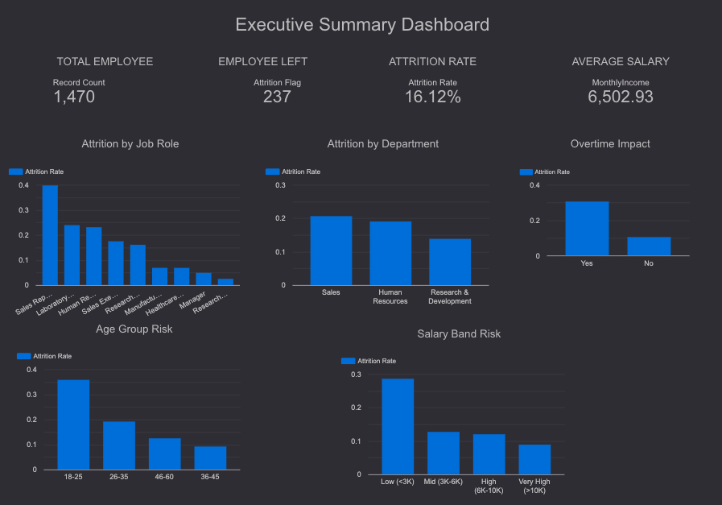
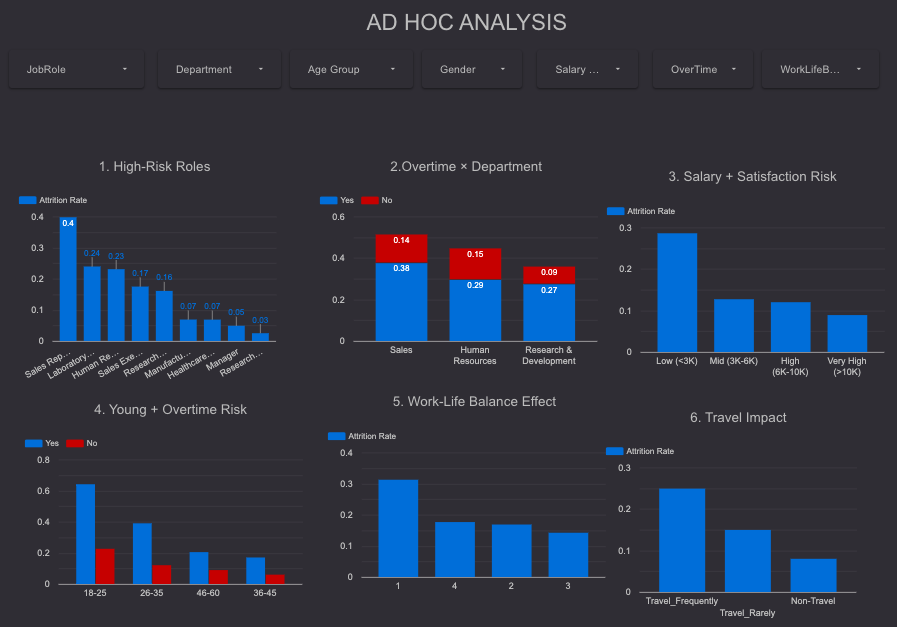

# HR Employee Attrition Analysis & Prediction

**IBM HR Analytics Dataset | MIS Dashboard + Ad Hoc Reporting + Machine Learning**

---

## Project Overview

Employee attrition impacts productivity, hiring costs, and organizational stability.

This project is designed with an **MIS Reporting mindset**, combining:

* Dashboard reporting
* Ad hoc business analysis
* Predictive modeling

The goal is to simulate how a Reporting Analyst supports **real-time business decision-making**.

---
This project combines **Python (Pandas/Scikit-Learn)** for predictive modeling and **Looker Studio** for executive-level business intelligence.

##  Interactive Dashboards
I developed a dual-page reporting system to help stakeholders identify risk factors and trends.

### 1. Executive Summary
Focuses on high-level KPIs like total attrition rate (16.12%), salary impacts, and job role distribution.

### 2. Ad-Hoc Analysis
Provides deep-dives into specific segments such as Overtime vs. Department and Age Group risks.

---

## Objectives

* Analyze employee attrition patterns
* Identify high-risk employee segments
* Perform ad hoc business queries (real-world scenarios)
* Predict attrition using machine learning
* Provide actionable HR insights

---

## Tech Stack

* **Python**
* **Pandas, NumPy** → Data Processing
* **Matplotlib** → Visualization
* **Scikit-learn** → Machine Learning

---

## Dataset

* IBM HR Analytics Employee Attrition Dataset
* **Total Employees:** 1,470
* Includes:

  * Demographics (Age, Gender, Marital Status)
  * Job Details (Department, Role, Salary)
  * Work Metrics (Overtime, Tenure, Travel)
  * Satisfaction Scores

---

## MIS Dashboard Analysis

### Key Insights:

* Higher attrition observed in **overtime employees**
* **Low salary bands** show increased attrition
* Employees in **0–2 years tenure** are most at risk
* Certain **job roles and departments** have higher exit rates

! [Chart](images/hr_attrition_charts.png)

---

## Ad Hoc Business Queries (MIS Perspective)

This project includes ad hoc analysis to simulate real-world stakeholder questions:

### High-Risk Job Roles

Identified job roles with attrition rate above 25%, helping HR focus retention strategies.

### Overtime Impact in Sales

Employees working overtime in Sales show higher attrition, indicating workload pressure.

### Salary + Job Satisfaction Risk

Low salary combined with low job satisfaction leads to significantly higher attrition.

### Early Career Risk (Age + Overtime)

Young employees (18–25) working overtime are more likely to leave.

### Work-Life Balance Effect

Better work-life balance scores reduce attrition probability.

### Business Travel Impact

Frequent business travel is associated with increased attrition.

---

## Machine Learning Model

### Model Used

* Logistic Regression (Binary Classification)

### Why Logistic Regression?

* Interpretable model
* Suitable for HR decision-making
* Provides probability-based predictions

---

## ML Pipeline

1. Data Cleaning & Feature Engineering
2. One-Hot Encoding for categorical variables
3. Train-Test Split (80/20, stratified)
4. Feature Scaling (StandardScaler)
5. Logistic Regression with class balancing

---

## Model Performance

* Accuracy: ~75%–85%
* Balanced prediction across classes
* Evaluation Metrics:

  * Classification Report
  * Confusion Matrix

---

## Key Drivers of Attrition

* Overtime
* Low salary
* Low job satisfaction
* Frequent business travel
* Early tenure (0–2 years)

---

## Business Recommendations

* Reduce excessive overtime workload
* Improve engagement in first 2 years
* Optimize salary structures
* Enhance work-life balance policies
* Monitor high-risk job roles proactively

---

## Outputs Generated

* Clean dataset: `hr_attrition_clean.csv`
* Dashboard: ! [Chart](images/hr_attrition_charts.png)
* ML predictions & evaluation

---

## Key Learnings

* Handling categorical data using One-Hot Encoding
* Combining MIS reporting with machine learning
* Interpreting model outputs for business decisions
* Performing ad hoc analysis for stakeholder queries

---

## Future Improvements

* Implement Random Forest / XGBoost
* Add ROC-AUC evaluation
* Deploy as Streamlit dashboard
* Integrate real-time HR monitoring

---

## Author

**Sandip Bhattacharya**
Aspiring Data Analyst / MIS Analyst

---

## Project Highlight

Designed to replicate real-world MIS reporting by combining:
Structured dashboards
Ad hoc business queries
Predictive analytics

---
