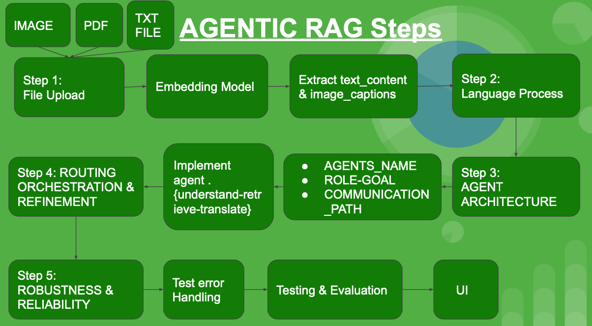
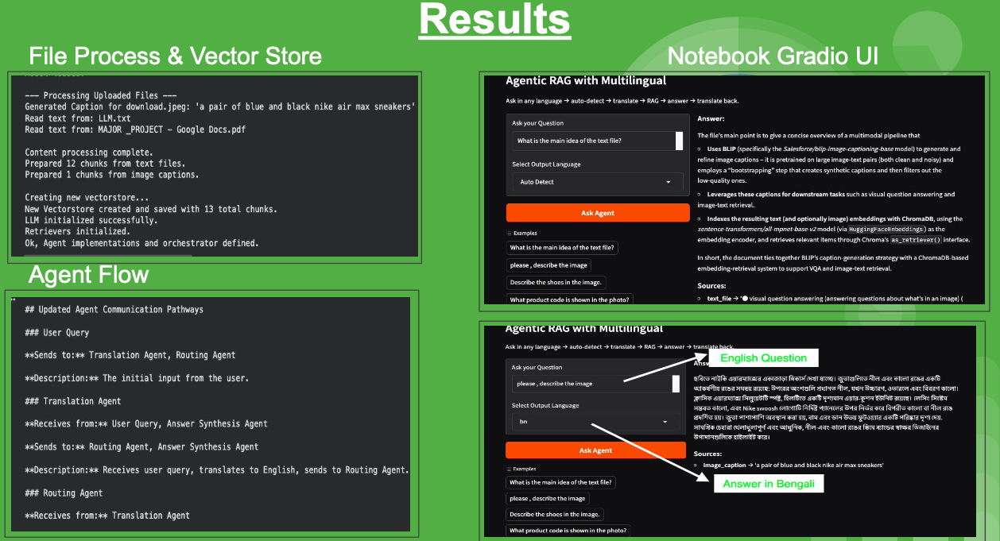
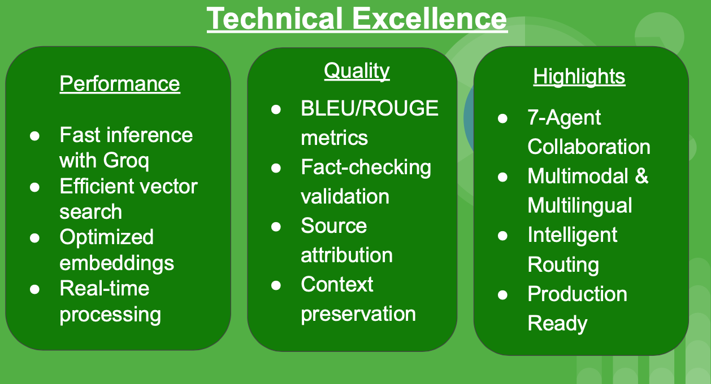

# Document Intelligence & Automated Reporting Assistant [Nexus RAG - Multimodal - Multilingual]

This Google Colab notebook implements an advanced Retrieval-Augmented Generation (RAG) system featuring a multi-agent architecture with multilingual and multimodal capabilities. The system can process text documents and image captions, understand queries in various languages, and provide comprehensive answers.

## Table of Contents

- [Introduction](#introduction)
- [Features](#features)
- [Architecture](#architecture)
- [Setup](#setup)
- [Usage](#usage)
- [Error Handling & Logging](#error-handling--logging)
- [Evaluation](#evaluation)

## Introduction

This project demonstrates a sophisticated RAG pipeline designed to handle diverse information sources (text and images) and user queries in multiple languages. It leverages a team of specialized AI agents that collaborate to understand, retrieve, synthesize, and translate information, ensuring accurate and contextually relevant responses.

## Features

- **Multilingual Support**: Automatically detects query language, translates for processing, and translates the answer back to the user's original language.
- **Multimodal RAG**: Processes both text documents (TXT, PDF) and images (JPEG, JPG, PNG) by generating captions for images.
- **Dynamic Agent Orchestration**: A central orchestrator directs queries to specialized agents (Translation, Routing, Research, Image Analysis, Summarization, Fact-Checking) based on query intent.
- **Semantic Routing**: Utilizes embedding similarity to intelligently route queries to the most appropriate agent, enhancing accuracy and efficiency.
- **Summarization Agent**: Condenses lengthy content into concise summaries.
- **Fact-Checking Agent**: Verifies claims against the knowledge base for increased reliability.
- **Robust Error Handling**: Comprehensive error propagation and user-friendly error messages.
- **Logging**: Basic logging implemented for better traceability and debugging.
- **Interactive UI**: A Gradio-based interface for easy interaction and testing.

## Architecture

The system is built around a multi-agent framework with distinct roles and communication pathways:

- **Translation Agent**: Handles multilingual input/output.
- **Routing Agent**: Directs queries based on intent (text, image, summarize, fact-check).
- **Research Agent**: Gathers information from text documents.
- **Image Analysis Agent**: Extracts insights from image captions.
- **Summarization Agent**: Generates summaries of content.
- **Fact-Checking Agent**: Verifies claims.
- **Answer Synthesis Agent**: Formulates final answers from gathered information.

Communication between agents ensures a seamless flow of information and task delegation.

## Setup

To run this notebook, follow these steps:

1.  **Install Dependencies**: Run the first code cell to install all required Python libraries.
2.  **Load GROQ API Key**: Ensure your `GROQ_API_KEY` is set in Google Colab secrets. This key is crucial for initializing the Language Model (LLM).
3.  **Upload Files**: Use the provided file uploader to upload your `.txt`, `.pdf`, and image (`.jpeg`, `.jpg`, `.png`) files into the `uploaded_content` directory. These files form your knowledge base.
4.  **Process Files and Create Vectorstore**: Run the cells that process uploaded files, generate image captions using the BLIP model, and build the ChromaDB vector store for efficient retrieval.
5.  **Initialize Agents**: The subsequent cells define and initialize the various agents and the orchestration logic.

## Usage

Once setup is complete, you can interact with the system via the Gradio interface:

1.  **Launch Gradio UI**: Run the final code cell to launch the interactive user interface.
2.  **Enter Query**: Type your question in the 

